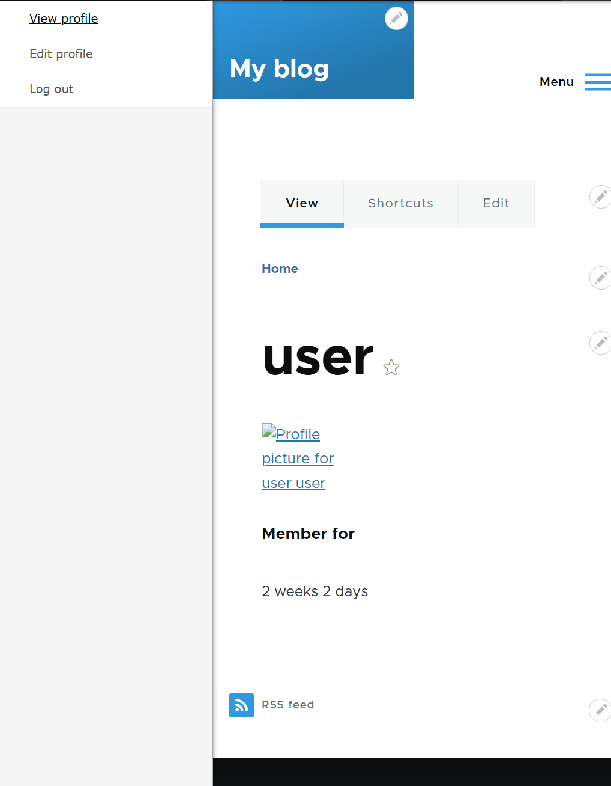

# Task 002 - Configure Auto Scaling


* Follow the instructions in the tutorial [Getting started with Amazon EC2 Auto Scaling](https://docs.aws.amazon.com/autoscaling/ec2/userguide/GettingStartedTutorial.html) to create a launch template.

* [CLI Documentation](https://docs.aws.amazon.com/cli/latest/reference/autoscaling/)

## Pre-requisites

* Networks (RTE-TABLE/SECURITY GROUP) set as at the end of the Labo2.
* 1 AMI of your Drupal instance
* 0 existing ec2 (even is in stopped state)
* 1 RDS Database instance - started
* 1 Elastic Load Balancer - started

## Create a new launch configuration. 

|Key|Value|
|:--|:--|
|Name|LT-DEVOPSTEAM[XX]|
|Version|v1.0.0|
|Tag|Name->same as template's name|
|AMI|Your Drupal AMI|
|Instance type|t3.micro (as usual)|
|Subnet|Your subnet A|
|Security groups|Your Drupal Security Group|
|IP Address assignation|Do not assign|
|Storage|Only 10 Go Storage (based on your AMI)|
|Advanced Details/EC2 Detailed Cloud Watch|enable|
|Purchase option/Request Spot instance|disable|

```
[INPUT]
//cli command
aws autoscaling create-launch-configuration \
    --launch-configuration-name LT-DEVOPSTEAM10 \
    --image-id $(aws ec2 describe-images \
    --query "Images[?Name=='AMI_DRUPAL_DEVOPSTEAM10_LABO02_RDS'].ImageId" --output text) \
    --instance-type t3.micro \
    --security-groups $(aws ec2 describe-security-groups \
    --query "SecurityGroups[?GroupName=='SG-PRIVATE-DRUPAL-DEVOPSTEAM10'].GroupId" --output text) \
    --key-name CLD_KEY_DRUPAL_DEVOPSTEAM10 \
    --associate-public-ip-address false \
    --block-device-mappings "[{\"DeviceName\":\"/dev/xvda\",\"Ebs\":{\"VolumeSize\":10}}]" \
    --instance-monitoring Enabled=true \
    --no-ebs-optimized
    --tags Key=Name,Value=LT-DEVOPSTEAM10

[OUTPUT]
TODO
```

## Create an auto scaling group

* Choose launch template or configuration

|Specifications|Key|Value|
|:--|:--|:--|
|Launch Configuration|Name|ASGRP_DEVOPSTEAM[XX]|
||Launch configuration|Your launch configuration|
|Instance launch option|VPC|Refer to infra schema|
||AZ and subnet|AZs and subnets a + b|
|Advanced options|Attach to an existing LB|Your ELB|
||Target group|Your target group|
|Health check|Load balancing health check|Turn on|
||health check grace period|10 seconds|
|Additional settings|Group metrics collection within Cloud Watch|Enable|
||Health check grace period|10 seconds|
|Group size and scaling option|Desired capacity|1|
||Min desired capacity|1|
||Max desired capacity|4|
||Policies|Target tracking scaling policy|
||Target tracking scaling policy Name|TTP_DEVOPSTEAM[XX]|
||Metric type|Average CPU utilization|
||Target value|50|
||Instance warmup|30 seconds|
||Instance maintenance policy|None|
||Instance scale-in protection|None|
||Notification|None|
|Add tag to instance|Name|AUTO_EC2_PRIVATE_DRUPAL_DEVOPSTEAM[XX]|

```
[INPUT]
//cli command
aws autoscaling create-auto-scaling-group \
    --auto-scaling-group-name ASGRP_DEVOPSTEAM10 \
    --launch-configuration-name ASGRP_DEVOPSTEAM10 \
    --min-size 1 \
    --max-size 4 \
    --desired-capacity 1 \
    --vpc-zone-identifier "subnet-02291f4084cacd8c9, subnet-06579a70777df8833" \
    --health-check-type ELB \
    --health-check-grace-period 10 \
    --target-group-arns arn:aws:elasticloadbalancing:eu-west-3:709024702237:targetgroup/TG-DEVOPSTEAM10/49cb5841e91f6eeb \
    --termination-policies "OldestLaunchConfiguration" \
    --tags Key=Name,Value=AUTO_EC2_PRIVATE_DRUPAL_DEVOPSTEAM10 \
    --new-instances-protected-from-scale-in \
    --metrics CollectionEnabled=true
    

[OUTPUT]
```

* Result expected

The first instance is launched automatically.

Test ssh and web access.

```
[INPUT]
//ssh login
ssh -i CLD_KEY_DMZ_DEVOPSTEAM10.pem devopsteam10@15.188.43.46 -L 2223:10.0.10.138:22
ssh bitnami@localhost -p 2223 -i CLD_KEY_DRUPAL_DEVOPSTEAM10.pem
[OUTPUT]
Linux ip-10-0-0-5 6.1.0-18-cloud-amd64 #1 SMP PREEMPT_DYNAMIC Debian 6.1.76-1 (2024-02-01) x86_64

The programs included with the Debian GNU/Linux system are free software;
the exact distribution terms for each program are described in the
individual files in /usr/share/doc/*/copyright.

Debian GNU/Linux comes with ABSOLUTELY NO WARRANTY, to the extent
permitted by applicable law.
Last login: Thu Apr 11 14:41:11 2024 from 185.144.39.29

Debian GNU/Linux comes with ABSOLUTELY NO WARRANTY, to the extent
permitted by applicable law.
       ___ _ _                   _
      | _ |_) |_ _ _  __ _ _ __ (_)
      | _ \ |  _| ' \/ _` | '  \| |
      |___/_|\__|_|_|\__,_|_|_|_|_|

  *** Welcome to the Bitnami package for Drupal 10.2.3-1        ***
  *** Documentation:  https://docs.bitnami.com/aws/apps/drupal/ ***
  ***                 https://docs.bitnami.com/aws/             ***
  *** Bitnami Forums: https://github.com/bitnami/vms/           ***
Last login: Sat Mar 23 09:27:53 2024 from 10.0.0.5

```

```
//screen shot, web access (login)

```