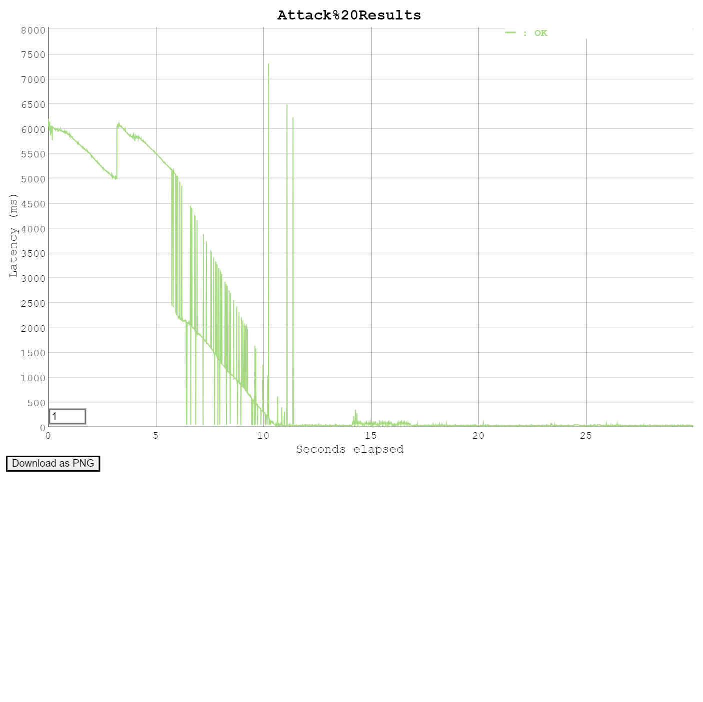
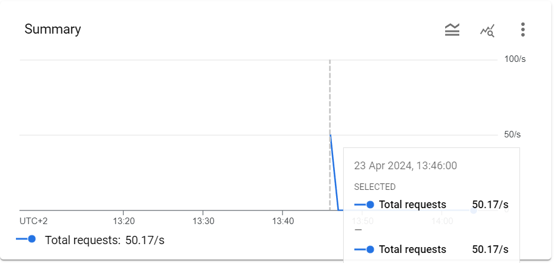
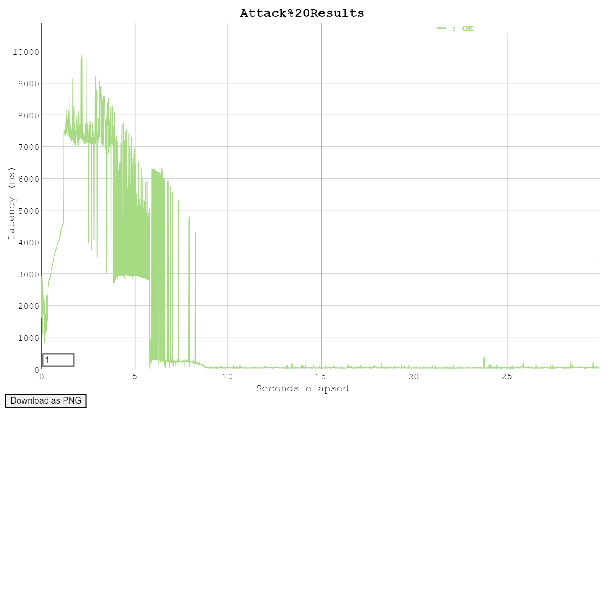
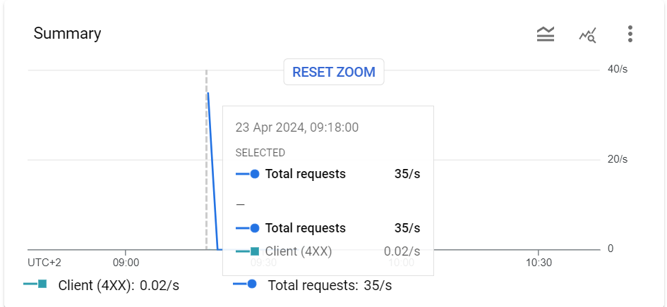
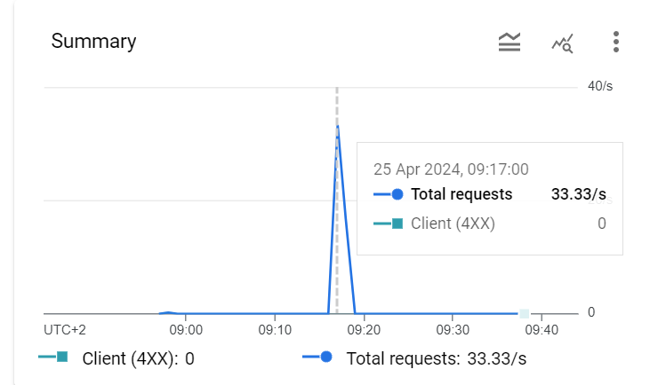
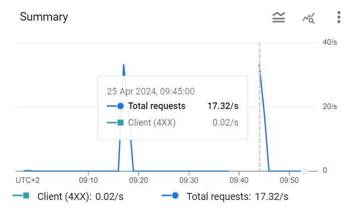
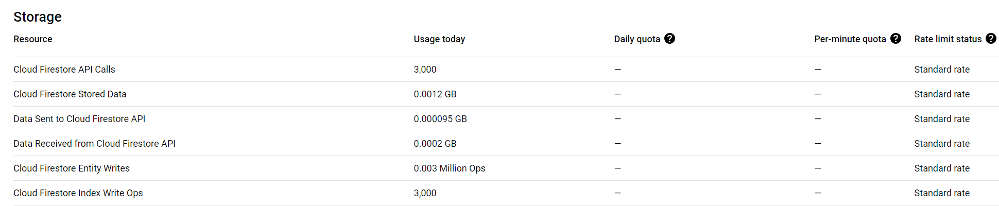

## Task 3: Test the performance of Datastore writes

In this task you will performance test the App Engine platform with a
load generator. You will compare the performance of normal request
processing and request processing that involves Datastore write
operations.

As the Servlets are deployed with Automatic Scaling, there is a danger
of consuming a lot of resources while testing, and burning through a
lot of money. Google gave you a coupon with some money that was put
into a billing account. Projects can have spending limits, but by
default it is unlimited. Before starting the performance test, you
have to set a reasonable daily spending limit.

Set a daily spending limit on the project as follows:

- In the Cloud Platform console navigate to **App Engine** >
  **Settings**. Click on **Edit**. Enter a daily spending limit of
  **$1.00**. (Note: Google has removed this functionality in January 2020. There is no replacement for it yet. Skip this step, but observe how many credits you have left before and after the performance tests. You can also limit the number of instances with an optional configuration of the autoscaling algorithm: In the file `appengine-web.xml` in the `<automatic-scaling>` element add a `<max-instances>` element with a small value (3, 4, ...). See <https://cloud.google.com/appengine/docs/standard/java/config/appref#scaling_elements>. An alternative is to use **Budgets & alerts**. In the Cloud Platform console navigate to **Billing** > **Budgets & alerts**. Create a new budget for the month for an amount of **$1.00** and optionally set the actions associated with the alert.)

Conduct the performance tests as follows:

1. You should already have vegeta installed from previous labs. If not, see [https://blog.absyah.dev/super-simple-guide-for-load-testing-using-vegeta#heading-install-vegeta](https://blog.absyah.dev/super-simple-guide-for-load-testing-using-vegeta#heading-install-vegeta).
2. First test the performance of normal request processing using the
   Servlet generated by the wizard.

   - Prepare an "attack" using vegeta.
   - In the App Engine console open the **Dashboard**.
   - Run the attack.
   - In the dashboard observe the graph of the incoming requests, the
     number of instances and the latency.
3. Test the performance of the Servlet that writes to the Datastore.
4. At the end of the tests observe in detail how much resources were
   used. In the console click on **Quota Details**.
5. If you are running out of resources because of the monthly spending
   limit, increase it carefully by a dollar or two.

Deliverables:

- For each performance test, write the command used to generate the attack with vegeta and copy the file generated by the vegeta plot command.

1. Experiment Normal request processing with vegeta.

```
//TODO command used
echo "GET https://20240422t103039-dot-labgae-420715.ew.r.appspot.com" | vegeta attack -duration=30s -rate=100 | tee results-1.bin | vegeta report
```

```
//TODO copy/link file generated by vegeta plot command
Requests      [total, rate, throughput]         3000, 100.03, 99.93
Duration      [total, attack, wait]             30.022s, 29.99s, 32.118ms
Latencies     [min, mean, 50, 90, 95, 99, max]  27.834ms, 1.353s, 41.408ms, 5.663s, 5.894s, 6.047s, 7.322s
Bytes In      [total, mean]                     4617000, 1539.00
Bytes Out     [total, mean]                     0, 0.00
Success       [ratio]                           100.00%
Status Codes  [code:count]                      200:3000
Error Set:

vegeta plot -title="Result 1" results-1.bin > results-1.html 
```


// TODO remove capture


2. Experiment Datastore write performance with vegeta.

```
//TODO command used
  echo "GET https://20240422t103039-dot-labgae-420715.ew.r.appspot.com/datastorewrite?_kind=book" | vegeta attack -duration=30s -rate=100 | tee results-2.bin | vegeta report
```

```
//TODO copy/link file generated by vegeta plot command

Requests      [total, rate, throughput]         3000, 100.03, 99.87
Duration      [total, attack, wait]             30.039s, 29.99s, 48.64ms
Latencies     [min, mean, 50, 90, 95, 99, max]  40.815ms, 2.555s, 192.495ms, 7.121s, 7.236s, 9.413s, 11.523s
Bytes In      [total, mean]                     126000, 42.00
Bytes Out     [total, mean]                     0, 0.00
Success       [ratio]                           100.00%
Status Codes  [code:count]                      200:3000
Error Set:

vegeta plot -title="Result 2" results-2.bin > results-2.html

Plot:
```



// TODO remove capture


- What response times do you observe for each Servlet?

  ```
  //TODO
  The first Servlet starts at around 6000 ms and drop until 10 seconds then finishes with low and stabilized latency. The second Servlet will start with a smaller latency, around 2000 ms and will peak at 10000 ms, drop slowly and finishes with low and stabilized latency.
  ```
- Compare the response times shown by vegeta with the App Engine
  console. Explain the difference.

  ```
  //TODO
  
  
  
  For the first and second servlet, we can notice that the response time is slower in the App Engine console than in vegeta and does not oscillate as much. 
  This is because the App Engine console averages the response time over a longer period of time, while vegeta shows the response time of each request.
  ```

In vegeta, we have the response time of the server, while in the App Engine console, we have the response time of the server and the time to get the data from the Datastore.

```

- How many resources have you used to run these tests? From the
**Quota Details** view of the console determine the non-zero resource
quotas (**Daily quota** different from 0%). Explain each with a sentence.
To get a sense of everything that is measured click on **Show resources not in use**.

```

In total, we have 6 resources used.

- Cloud Firestore API Calls: It is the number of calls made to the Cloud Firestore API.
- Cloud Firestore Stored Data: It is the amount of data stored in the Cloud Firestore, measured in GB.
- Data Sent to Cloud Firestore API: It is the amount of data sent to the Cloud Firestore API, measured in GB.
- Data Received from Cloud Firestore API: It is the amount of data received from the Cloud Firestore API, measured in GB.
- Cloud Firestore Entity Writes: It is the number of writes made to the Cloud Firestore entity, measured in GB.
- Cloud Firestore Index Write Ops: It is the number of write operations made to the Cloud Firestore index, measured in number of operations.

Cloud Firestore is the database used by the Datastore.

```

- Let's suppose you become suspicious that the algorithm for the automatic scaling of
instances is not working correctly. Imagine a way in which the algorithm could be broken. Which measures shown in the console would you use to detect this failure?

```
Check the number of instances used in the App Engine console. If the number of instances is not increasing or decreasing according to the number of requests or CPU usage, then the algorithm might be broken.

```

## Troubleshooting

If your Servlet that writes to the Datastore works OK on your local
machine, but you get a server error when running it in the Google
cloud, have a look at the logs (hamburger menu > Logs). If you see a
NoClassDefFoundError related to the Datastore you have run into a
[problem that was reported to Google on March 22, 2018](https://issuetracker.google.com/issues/76144204). The
problem is that the library for the Datastore,
`appengine-api-1.0-sdk`, is missing. Previously it was automatically
included by Google.

Here is a workaround:

- Create a new project (Google App Engine Standard Environment) that
has Maven activated (option on the first screen of the wizard).
- Edit the file `pom.xml`: In the dependency declaration for
`appengine-api-1.0-sdk` change the scope from `provided` to
`compile` (this will include the dependency in the jar that is
uploaded to Google).
- _Clean_ the project.
```
